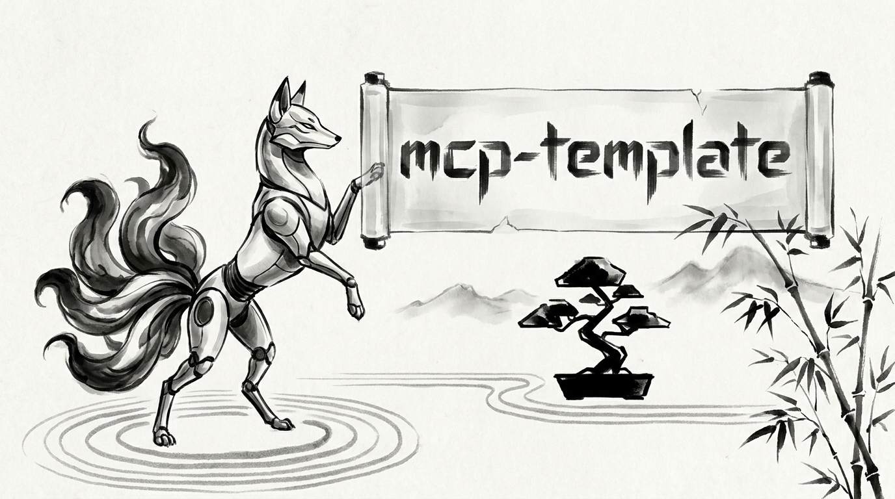

# mcp-template

<p align="center">
  
</p>

<p align="center">
<b>Batteries-included Python template. One codebase ships as a CLI, an MCP server, and an HTTP API over a shared service registry.</b>
</p>

<p align="center">
  <a href="#key-features">Key Features</a> •
  <a href="#architecture">Architecture</a> •
  <a href="#quick-start">Quick Start</a> •
  <a href="#cli-usage">CLI Usage</a> •
  <a href="#adding-commands">Adding Commands</a> •
  <a href="#configuration">Configuration</a> •
  <a href="manual_docs/deploy.md">Deploy</a> •
  <a href="#credits">Credits</a>
</p>

<p align="center">
  <a href="https://railway.com/deploy/gmailmcp"></a>
  &nbsp;
  <a href="https://render.com/deploy?repo=https://github.com/Miyamura80/MCP-Template"></a>
</p>

<p align="center">
  
  
  
  
  <a href="https://skills.sh/Miyamura80/MCP-Template"></a>

</p>

---

## Agent Prompt

> Copy and paste this into your AI coding agent (Claude Code, Cursor, Copilot, etc.) to install:

```text
Install the CLI and download the gmail-mcp skill:

pip install mcp-template

curl -fsSL https://raw.githubusercontent.com/Miyamura80/MCP-Template/main/scripts/install-skills.sh -o install-skills.sh
bash install-skills.sh && rm install-skills.sh
```

The official **gmail-mcp** agent skill is self-published on
[skills.sh](https://skills.sh/Miyamura80/MCP-Template). Install it directly with:

```bash
npx skills add Miyamura80/MCP-Template
```

The skill's source of truth lives in [`skills/gmail-mcp/SKILL.md`](skills/gmail-mcp/SKILL.md);
`make sync-skills` mirrors it to the landing page's
`/.well-known/agent-skills/` discovery tree (digest-pinned in `index.json`).

## App Distribution

- MCP server with OAuth
- Claude and ChatGPT connectors
- APIs and SDKs
- Chat interfaces like iMessage and WhatsApp
- A dashboard that uses the same MCP layer
- Open source

## Key Features

| Feature | Stack |
|---|---|
| CLI (auto-discovery commands, global flags, shell completions, self-update) | Typer |
| MCP server (streamable HTTP at `/mcp`, services auto-registered as tools; stdio supported for local dev) | FastMCP |
| HTTP API server (also hosts `/mcp`) | FastAPI + Uvicorn |
| Auth | WorkOS + API keys |
| Payments | Stripe |
| Database + migrations | SQLAlchemy + Alembic |
| Config (YAML + `.env`) | Pydantic-settings |
| LLM inference + observability | DSPY + LiteLLM + LangFuse |
| Testing | pytest + `TestTemplate` |
| Lint / type / dead-code | Ruff + Vulture + ty + import-linter |
| Pre-commit (folder size, ai-writing, agent-config sync) | prek |
| Telemetry | Anonymous, opt-out |

## Architecture

One codebase, three interfaces. Write business logic once in `services/` and it ships as a CLI subcommand, an MCP tool, and an HTTP route - same Pydantic input/output contract everywhere.

```
┌──────────────┐  ┌──────────────┐  ┌──────────────┐
│ src/cli/app  │  │ mcp_server/  │  │ api_server/  │   transport / interface
│  (Typer)     │  │ (FastMCP)    │  │ (FastAPI)    │
└──────┬───────┘  └──────┬───────┘  └──────┬───────┘
       │                 │                 │
       └─────────────────┼─────────────────┘
                         ▼
                 ┌───────────────┐
                 │  services/    │   pure @service functions
                 │  @service     │   (transport-agnostic)
                 └───────┬───────┘
                         ▼
                 ┌───────────────┐
                 │  models/      │   Pydantic I/O contracts
                 └───────┬───────┘
                         ▼
        ┌────────────┬───────┬────────────┬─────────────┐
        │ common/    │ db/   │ utils/llm/ │ src/utils/  │   shared infra
        │ (config)   │ (ORM) │ (DSPY)     │ (logs/theme)│
        └────────────┴───────┴────────────┴─────────────┘
```

### MCP UI (optional)

Need elicitation, image output, or an iframe dashboard for an MCP tool? Add an opt-in **enhancer** in `mcp_server/enhancers/`. Enhancers wrap a service for the MCP transport only - the pure service stays untouched and CLI/API consumers are unaffected.

See [`mcp_server/MCP_UI_ARCHITECTURE.md`](mcp_server/MCP_UI_ARCHITECTURE.md) for the full design.

## Quick Start

```bash
make onboard              # interactive setup (rename, deps, env, hooks)
uv sync                   # install deps
uv run mymcp --help       # see all CLI commands
uv run mymcp greet Alice  # run a command
uv run mymcp init my_command  # scaffold a new command

uv run mymcp-serve        # start the server (HTTP API + MCP at /mcp on one port)
uv run mymcp-mcp          # legacy: stdio MCP only, for local Claude Desktop / dev
```

## Deploy

One-click deploy to Railway or Render (backend + managed Postgres, migrations run automatically). See **[deployment docs](manual_docs/deploy.md)** for the per-platform setup, the Railway template variable map, and OAuth/secret wiring.

## CLI Usage

Global flags go **before** the subcommand:

| Flag | Short | Description |
|---|---|---|
| `--verbose` | `-v` | Increase output verbosity |
| `--quiet` | `-q` | Suppress non-essential output |
| `--debug` | | Show full tracebacks on error |
| `--format` | `-f` | Output format: `table`, `json`, `plain` |
| `--dry-run` | | Preview actions without executing |
| `--version` | `-V` | Print version and exit |

```bash
uv run mymcp --format json config show     # JSON output
uv run mymcp --dry-run greet Bob           # preview without executing
uv run mymcp --verbose greet Alice         # detailed output
```

## Adding Commands

Drop a Python file in `src/cli/commands/` and it is auto-discovered.

**Single command** - export a `main()` function:

```python
# src/cli/commands/hello.py
from typing import Annotated
import typer

def main(name: Annotated[str, typer.Argument(help="Who to greet.")]) -> None:
    """Say hello."""
    typer.echo(f"Hello, {name}!")
```

```bash
uv run mymcp hello World   # Hello, World!
```

**Subcommand group** - export `app = typer.Typer()`:

```python
# src/cli/commands/db.py
import typer

app = typer.Typer()

@app.command()
def migrate() -> None:
    """Run migrations."""
    ...
```

```bash
uv run mymcp db migrate
```

Or scaffold with: `uv run mymcp init my_command --desc "Does something"`.

## Configuration

```python
from common import global_config

# Access config values from common/global_config.yaml
global_config.example_parent.example_child

# Access secrets from .env
global_config.OPENAI_API_KEY
```

CLI config inspection:

```bash
uv run mymcp config show                           # full config
uv run mymcp config get llm_config.cache_enabled   # single value
uv run mymcp config set logging.verbose false      # write override
```

[Full configuration docs](manual_docs/configuration.md)

## Credits

This software uses the following tools:
- [Cursor: The AI Code Editor](https://cursor.com)
- [uv](https://docs.astral.sh/uv/)
- [Typer: CLI framework](https://typer.tiangolo.com/)
- [Rich: Terminal formatting](https://rich.readthedocs.io/)
- [prek: Rust-based pre-commit framework](https://github.com/j178/prek)
- [DSPY: Pytorch for LLM Inference](https://dspy.ai/)
- [LangFuse: LLM Observability Tool](https://langfuse.com/)

## About the Core Contributors

<a href="https://github.com/Miyamura80/MCP-Template/graphs/contributors">
  
</a>

Made with [contrib.rocks](https://contrib.rocks).
